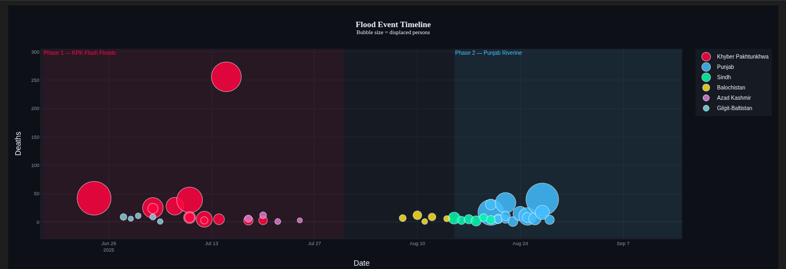

#  Pakistan 2025 Monsoon Flood Analysis

> Spatial & temporal flood mapping of the 2025 Pakistan monsoon floods using NDMA verified data, VIIRS satellite imagery, and Sentinel-1 SAR.



---

## 📋 Overview

| Property | Value |
|---|---|
| **Districts** | 50 |
| **Provinces** | 6 |
| **Season** | 26 June – 1 October 2025 |
| **Variables** | 34 per district |
| **Missing values** | 0 |

---

## 🛰️ Data Sources

| Source | Data |
|---|---|
| NDMA / PDMA | Deaths, injuries, houses, roads, rescue |
| OCHA / UNICEF / WHO | Cross-verification |
| UNOSAT VIIRS | Flood extent polygons FL20250818PAK |
| Sentinel-1 SAR | Temporal flood zones via Google Earth Engine |

---

## 🔑 Key Findings

1. **Flash floods (KPK)** — small area, very high deaths per district
2. **Riverine floods (Punjab)** — large area, lower deaths per district
3. Flood **TYPE** not extent is the primary mortality determinant
4. Two distinct phases separated by ~2-week monsoon shift gap
5. **Children = 25%** of deaths — SDG 13 vulnerability indicator
6. **Buner** = worst district (256 deaths, single cloudburst event)
7. **Jhang** = most flooded (976 km² VIIRS) but only 1 death

---

## 📁 Repository Files

```
├── Pakistan_Flood_2025_Analysis_DOCUMENTED.ipynb  ← Main notebook (18 charts)
├── pakistan_flood_2025_CLEAN.csv                  ← Verified impact dataset
├── flood.png                                       ← Flood map figure
├── requirements.txt                                ← Python dependencies
└── README.md
```

---

## 🚀 Quick Start

```bash
git clone https://github.com/Saif3985/pakistan-flood-2025-analysis
cd pakistan-flood-2025-analysis
pip install -r requirements.txt
jupyter notebook Pakistan_Flood_2025_Analysis_DOCUMENTED.ipynb
```

---


## 🗺️ Methodology

```
NDMA/PDMA/OCHA ODS files (6 sources)
        ↓
District-level impact dataset (50 districts · 34 columns · 0 missing)
        ↓
UNOSAT VIIRS shapefile → flooded km² per district
        ↓
Sentinel-1 SAR via Google Earth Engine → temporal zones (Phase 1 & 2)
```

---

## 📄 Citation

```bibtex
@dataset{saifullah2026pakistan,
  title  = {Pakistan 2025 Monsoon Flood Impact Dataset},
  author = {Saifullah},
  year   = {2026},
  source = {NDMA, PDMA, OCHA, UNICEF, UNOSAT},
  url    = {https://github.com/Saif3985}
}
```

---

## 👤 Author

**Saifullah** — Remote Sensing Researcher

[](mailto:saifullahct5@gmail.com)
[](https://www.linkedin.com/in/saifullah-ds)
[](https://github.com/Saif3985)

---

